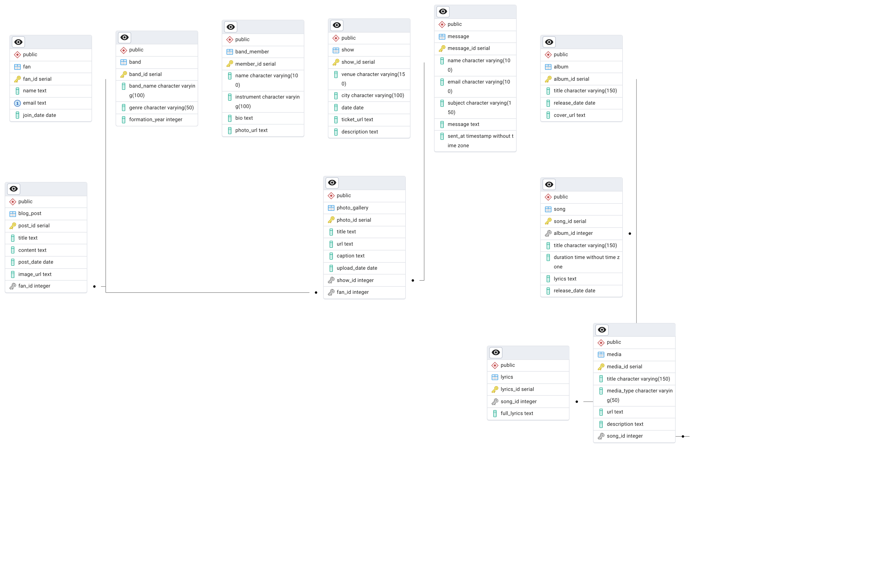

# Band Database Portfolio (PostgreSQL)

Schema and demo queries for a band’s albums, songs, and media.  
Includes runnable schema, demo data, and showcase JOINs.

## ERD


## Run locally
```bash
createdb band_db_demo
psql -d band_db_demo -f schema.sql
psql -d band_db_demo -f data.sql
psql -d band_db_demo -f queries.sql
